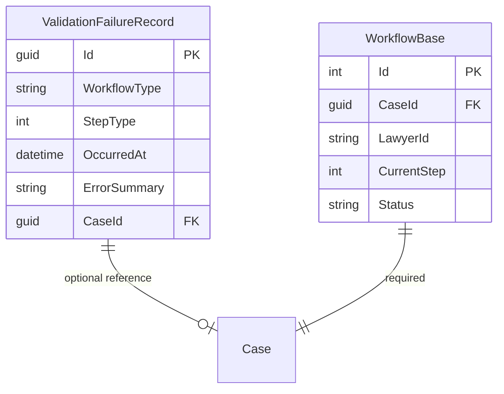

# Data Model: Backend Unification (045)

## New Entities

### ValidationFailureRecord

Records schema validation failures for admin observability (FR-014).

| Field | Type | Constraints | Description |
|-------|------|-------------|-------------|
| Id | Guid | PK, auto-generated | Unique identifier |
| WorkflowType | string | Required, max 100 | Pipeline id (e.g. "appeal-brief", "ruling-analysis") |
| StepType | int | Required | AiStepType enum integer value |
| OccurredAt | DateTime | Required | UTC timestamp of the failure |
| ErrorSummary | string | Required, max 2000 | Validation error message(s) |
| RawOutput | string? | Optional, max 2000 | Truncated raw AI output for debugging |
| CaseId | Guid? | Optional, FK → Cases | Case that triggered the failure |
| LawyerId | string? | Optional | Lawyer who initiated the analysis |
| CreatedAt | DateTime | Auto | Inherited from BaseEntity |
| UpdatedAt | DateTime | Auto | Inherited from BaseEntity |

**Location**: `Lawyer.Core/Models/ValidationFailureRecord.cs`  
**DbSet**: `Lawyer.Infrastracture` → `ApplicationDbContext`  
**Migration**: EF Core migration required.

---

## Modified Entities

### No schema changes to existing workflow entities

The existing `WorkflowBase` hierarchy (AppealWorkflow, AdminComplaintWorkflow, RulingAnalysisWorkflow, LegalWarningWorkflow, ExecRequestWorkflow) remains unchanged. SmartAnalysisService and PreparingStatementOfClaimsService entity tables (FactAnalysis, Defense, FinalPrayer, LawSuitFacts, etc.) are NOT modified in this phase.

---

## New Shared Types

### JsonOptions (Static class)

Centralized JSON serialization configuration (FR-001).

| Preset | Policy | Usage |
|--------|--------|-------|
| `Deserialize` | PropertyNameCaseInsensitive=true, AllowTrailingCommas=true | Reading AI output (tolerant) |
| `Serialize` | CamelCase naming policy | Writing to DB / API responses (canonical) |

**Location**: `Lawyer.Application/Common/JsonOptions.cs`

---

## Entity Relationships

---

## State Transitions

No change to existing workflow state machine (InProgress → Completed/Abandoned). The only addition:

- **Step execution failure path**: When schema validation fails → step is NOT persisted → `ValidationFailureRecord` is created → step remains at its current state (no advancement).
