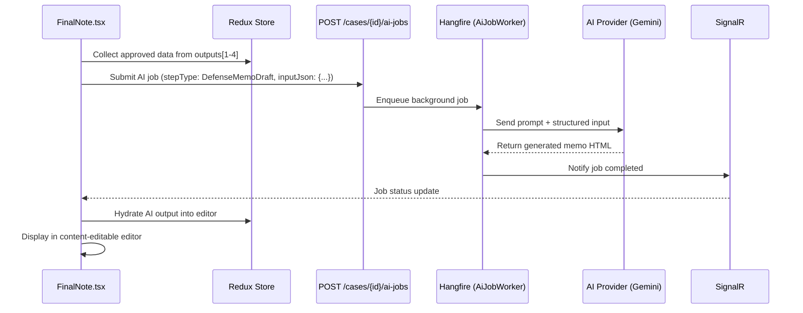

# Data Model: AI-Powered Final Defense Memorandum Generation

**Feature**: 064-ai-final-memo-generation  
**Date**: 2026-04-24

## No New Database Entities

This feature does **not** introduce new database tables or entities. It leverages the existing `AiJob` entity and `AiStageModelConfig` table.

## Existing Entities Used

### AiJob (existing — no schema changes)
| Field | Type | Notes |
|-------|------|-------|
| Id | Guid | PK |
| CaseId | Guid | FK → Cases |
| StepType | AiStepType (enum) | Uses existing `DefenseMemoDraft = 5` |
| Status | AiJobStatus (enum) | Queued → Processing → Completed/Failed |
| InputJson | string? | New: will now contain the structured input for AI generation |
| ResultJson | string? | The AI-generated memorandum HTML content |
| ErrorMessage | string? | Error details on failure |
| CreatedAt | DateTime | |
| StartedAt | DateTime? | |
| CompletedAt | DateTime? | |

### AiStageModelConfig (existing — no schema changes)
| Field | Type | Notes |
|-------|------|-------|
| Id | int | PK (auto) |
| StepType | AiStepType | Will now have an entry for `DefenseMemoDraft = 5` |
| ModelIdentifier | string | e.g., "gemini-3.1-flash-lite-preview" |
| UpdatedAt | DateTime | |
| UpdatedBy | string? | Admin email |

## New DTOs

### DefenseMemoDraftRequestDto (Backend — input for AI job)
```csharp
public class DefenseMemoDraftRequestDto
{
    public Guid CaseId { get; set; }
    public string CaseNumber { get; set; }
    public string CaseType { get; set; }
    public string CourtName { get; set; }
    public string ClientName { get; set; }
    public string ApponentName { get; set; }
    public string DefendingParty { get; set; } // "client" or "opponent"
    
    // From Step 1 (FactAnalysis)
    public List<string> LegalFactsSummary { get; set; }
    public List<DefendantPositionInput> DefendantsPositions { get; set; }
    
    // From Steps 2+3 (Approved Defenses with Explanations)
    public List<ApprovedDefenseInput> ApprovedDefenses { get; set; }
    
    // From Step 4 (Final Requirements)
    public List<FinalRequestInput> FinalRequests { get; set; }
}
```

### ApprovedDefenseInput (nested DTO)
```csharp
public class ApprovedDefenseInput
{
    public string DefenseTitle { get; set; }
    public string BasisFromCase { get; set; }
    public string Type { get; set; } // "Formal", "Substantive", "Evidentiary"
    
    // Full explanation from Step 3
    public DefenseExplanationInput Explanation { get; set; }
}
```

### DefenseExplanationInput (nested DTO)
```csharp
public class DefenseExplanationInput
{
    public string Introduction { get; set; }
    public string FactualBasis { get; set; }
    public List<LegalTextInput> LegalTexts { get; set; }
    public string LinkingTextsToFacts { get; set; }
    public List<CassationPrecedentInput> CassationPrecedents { get; set; }
    public string LegalApplication { get; set; }
    public string CounterArguments { get; set; }
    public string LegalEffectOfAcceptance { get; set; }
}
```

### DefenseMemoDraftResponseDto (Backend — output from AI)
```csharp
public class DefenseMemoDraftResponseDto
{
    public string MemoHtml { get; set; }  // Full HTML content of the generated memorandum
}
```

## Data Flow



## State Transitions

The `AiJob` follows the standard state machine:
```
Queued → Processing → Completed (ResultJson = memo HTML)
                    → Failed (ErrorMessage = error details)
```

## PipelineRegistry Change

Add `DefenseMemoDraft` as step 5 of the "smart-analysis" pipeline:
```csharp
new PipelineStepDefinition { 
    StepType = AiStepType.DefenseMemoDraft, 
    DisplayName = "تجميع مذكرة الدفاع" 
}
```

This changes "smart-analysis" TotalSteps from 4 to 5 and makes the step visible in Admin AI Model Settings.
